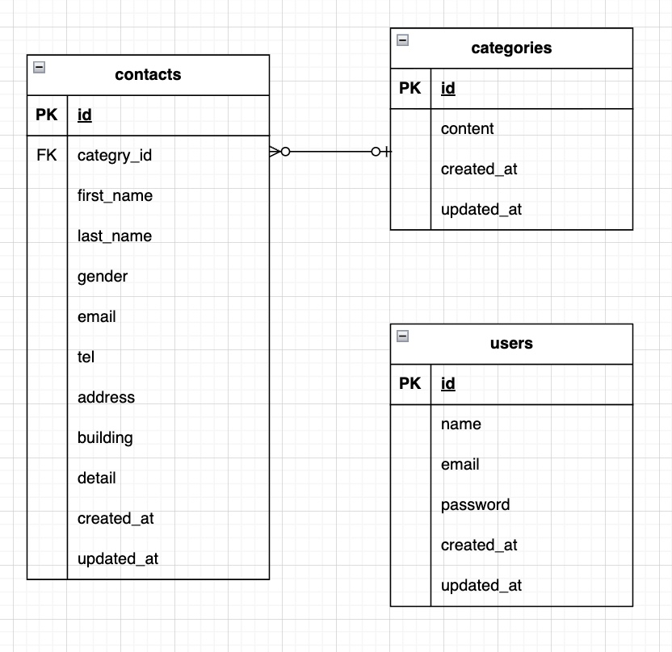

【開発環境設定】

◯開発環境のクローン
```bash
git clone git@github.com:daiki-oishi-0206/contact-form.git
```

◯対象のディレクトリに移動
```bash
cd contact-form
```

◯コンテナの作成・起動
```bash
docker compose up -d --build
```

◯Laravelパッケージのインストール
```bash
docker compose exec php bash
```
```bash
composer install
```

◯.envファイルの作成(.env.exampleからのコピー)
```bash
cp .env.example .env
```

◯.envファイルの編集
(変更前)
```env
DB_CONNECTION=mysql
DB_HOST=127.0.0.1
DB_PORT=3306
DB_DATABASE=laravel
DB_USERNAME=root
DB_PASSWORD=
```

(変更後)
```env
DB_CONNECTION=mysql
DB_HOST=mysql
DB_PORT=3306
DB_DATABASE=laravel_db
DB_USERNAME=laravel_user
DB_PASSWORD=laravel_pass
```

◯APP_KEYの作成
```bash
php artisan key:generate
```
◯マイグレーションの実行
```bash
php artisan migrate
```

◯seederの実行
```bash
php artisan db:seed
```

【開発環境】
-お問い合わせ画面：http://localhost/
-ユーザー登録：http://localhost/register
-phpMyAdmin：http://localhost:8080/

【使用技術(実行環境)】
-PHP 8.1.34
-Laravel 8.83.8
-MySQL 8.0
-nginx 1.21.1

【ER図】
